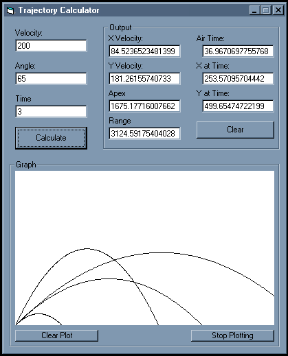



## Trajectory Calculation Functions \(With Graph\)

### Description

NOW WITH GRAPHING CAPABILITIES - I have been wanting to write a game like Cannons or Bang Bang for a while now, and haven't been able to find strong, simple, and correct calculations for ballistic trajectory. So, with a little search on Google.com, I found a few sites that show and explain the basics of ballistic trajectory calculations. I then transcribed the information i needed from the mathmatical libraries to code. All of the functions are broken down into very simple and uniform chunks. It is also in a single, easy to read module. Included is a simple example of how to utilize the functions inside the module. I hope this can help someone with aspirations like mine. Questions or comments can be directed to be via e-mail at martianman2001@hotmail.com
 
### More Info
 

             |
---                |---
**Submitted On**   |2004-05-23 22:33:10
**By**             |[Michael\-Keith Bernard \(\_Snoopy2K\)](https://github.com/Planet-Source-Code/PSCIndex/blob/master/ByAuthor/michael-keith-bernard-snoopy2k.md)
**Level**          |Intermediate
**User Rating**    |4.8 (24 globes from 5 users)
**Compatibility**  |VB 5\.0, VB 6\.0
**Category**       |[Complete Applications](https://github.com/Planet-Source-Code/PSCIndex/blob/master/ByCategory/complete-applications__1-27.md)
**World**          |[Visual Basic](https://github.com/Planet-Source-Code/PSCIndex/blob/master/ByWorld/visual-basic.md)
**Archive File**   |[Trajectory1749595242004\.zip](https://github.com/Planet-Source-Code/michael-keith-bernard-snoopy2k-trajectory-calculation-functions-with-graph__1-53991/archive/master.zip)

